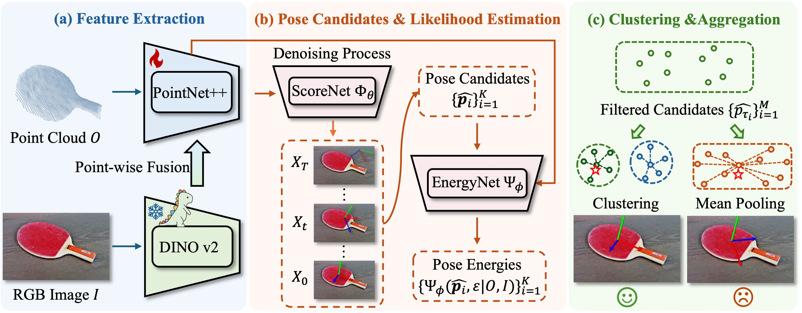

# GenPose++
[](https://jiyao06.github.io/Omni6DPose/)
[](https://arxiv.org/pdf/2406.04316.pdf)
[](https://jiyao06.github.io/Omni6DPose/download/)
[](https://github.com/Omni6DPose/Omni6DPoseAPI/)
[](https://jiyao06.github.io/Omni6DPose/cutoop/)
[](https://github.com/Omni6DPose/GenPose2/blob/main/LICENSE)
[](https://hits.seeyoufarm.com)

GenPose++的官方实现，如[Omni6DPose](https://jiyao06.github.io/Omni6DPose/)所述。（欧洲计算机视觉会议2024）




## ✨ 最新动态
* **2024年8月10日**：**GenPose++** 发布！🎉
* **2024年8月1日**：**<span style="color: #9AEA27;">Omni6DPose</span>** [数据集](https://github.com/Omni6DPose/Omni6DPoseAPI)和[应用程序接口](https://github.com/Omni6DPose/Omni6DPoseAPI)发布！🎉
* **2024年7月1日**：**<span style="color: #9AEA27;">Omni6DPose</span>** 已被2024年欧洲计算机视觉会议接受！🎉


## 📆 待办事项
- [x] 发布Omni6DPose数据集。
- [x] 发布Omni6DPose应用程序接口。
- [x] 发布GenPose++和预训练模型。
- [ ] 发布带有SAM的GenPose++便捷版本，用于下游任务。


## ⚙️ 要求
- Ubuntu 20.04
- Python 3.10.14
- Pytorch 2.1.0
- CUDA 11.8
- 1 * NVIDIA RTX 4090


## 🔨 安装

- ### 创建环境

```bash
conda create -n genpose2 python==3.10.14
conda activate genpose2
```

- ### 安装pytorch

``` bash
conda install cudatoolkit=11
pip install torch==2.1.0 torchvision==0.16.0 torchaudio==2.1.0 --index-url https://download.pytorch.org/whl/cu118
```

- ### 从requirements.txt安装

``` bash
pip install -r requirements.txt 
```

- ### 编译pointnet2

``` bash
cd networks/pts_encoder/pointnet2_utils/pointnet2
python setup.py install
```

- ### 编译Cutoop
我们提供了`cutoop`，这是用于Omni6DPose数据集的便捷工具。我们提供了两种安装方式。详细的安装说明可以在[Omni6DPoseAPI](https://github.com/Omni6DPose/Omni6DPoseAPI/)中找到。在那里我们提供了使用`pip`包管理器的安装说明。

```bash
sudo apt-get install openexr
pip install cutoop
```

## 🗂️ 下载数据集和模型

- 按照[Omni6DPoseAPI](https://github.com/Omni6DPose/Omni6DPoseAPI)页面上提供的说明下载并组织Omni6DPose数据集。请注意，GenPose++不需要`PAM`数据集以及`SOPE`数据集中的`depth_1.zip`、`coord.zip`和`ir.zip`文件。您可以省略下载这些文件以节省磁盘空间。

- 将`Meta`中的文件复制到`$ROOT/configs`目录。文件的组织应如下：

``` bash
genpose2
└──configs
   ├── obj_meta.json
   ├── real_obj_meta.json
   └── config.py
```

- 我们提供了经过训练的[检查点](https://www.dropbox.com/scl/fo/x87lhf7sygjm1gasz153g/AIHBlaGMjhfyW1bKrDe61R4?rlkey=y1f6dqdi40tzcgepccthayudp&st=1sbkxbzf&dl=0)。请将这些文件下载到`$ROOT/results`目录，并按如下方式组织：

``` bash
genpose2
└──results
   └── ckpts
       ├── ScoreNet
       │   └── scorenet.pth
       ├── EnergyNet
       │   └── energynet.pth
       └── ScaleNet
           └── scalenet.pth
```

## 🚀 训练

在`scripts/train_score.sh`、`scripts/train_energy.sh`和`scripts/train_scale.sh`中设置参数`--data_path`为您自己的SOPE数据集路径。

- ### 分数网络

  训练分数网络以生成姿态候选。

``` bash
bash scripts/train_score.sh
```

- ### 能量网络

  训练能量网络以聚合姿态候选。

``` bash
bash scripts/train_energy.sh
```

- ### 尺度网络
  训练尺度网络以预测边界框长度。
  尺度网络使用由分数网络提取的特征。如果您已经训练了自己的分数网络，可能需要在`scripts/train_scale.sh`中更改参数`--pretrained_score_model_path`。

``` bash
bash scripts/train_scale.sh
```

## 🎯 推理和评估

在`scripts/eval_single.sh`中设置参数`--data_path`为您自己的ROPE数据集路径。

- ### 评估姿态估计性能

``` bash
bash scripts/eval_single.sh
```

- ### 评估姿态跟踪性能

``` bash
bash scripts/eval_tracking.sh
```

- ### 单视频推理和可视化
``` bash
python runners/infer.py
```

## 🔖 引用

如果您发现我们的工作对您的研究有用，请考虑引用：

``` bash
@article{zhang2024omni6dpose,
  title={Omni6DPose: A Benchmark and Model for Universal 6D Object Pose Estimation and Tracking},
  author={Zhang, Jiyao and Huang, Weiyao and Peng, Bo and Wu, Mingdong and Hu, Fei and Chen, Zijian and Zhao, Bo and Dong, Hao},
  booktitle={European Conference on Computer Vision},
  year={2024},
  organization={Springer}
}
```

## 📮 联系

如果您有任何问题，请随时与我们联系：

[Jiyao Zhang](https://jiyao06.github.io/): [jiyaozhang@stu.pku.edu.cn](mailto:jiyaozhang@stu.pku.edu.cn)

[Weiyao Huang](https://github.com/sshwy): [sshwy@stu.pku.edu.cn](mailto:sshwy@stu.pku.edu.cn)

[Bo Peng](https://github.com/p-b-p-b): [bo.peng@stu.pku.edu.cn](mailto:bo.peng@stu.pku.edu.cn)

[Hao Dong](https://zsdonghao.github.io/): [hao.dong@pku.edu.cn](mailto:hao.dong@pku.edu.cn)

## 📝 许可证

本项目根据MIT许可证发布。有关更多详细信息，请参见[LICENSE](LICENSE)。